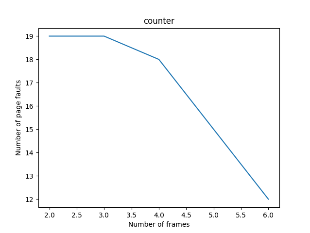
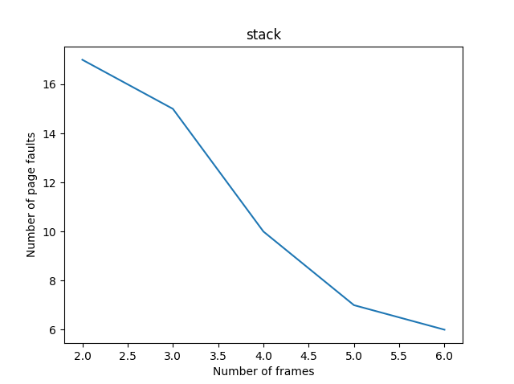
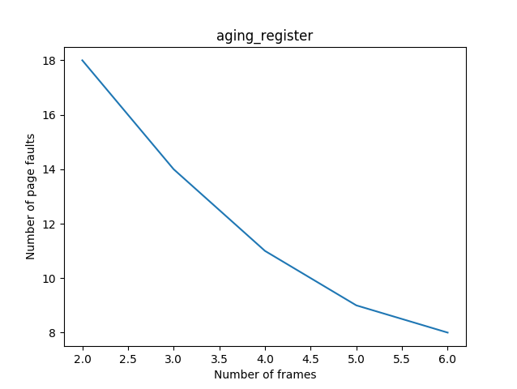
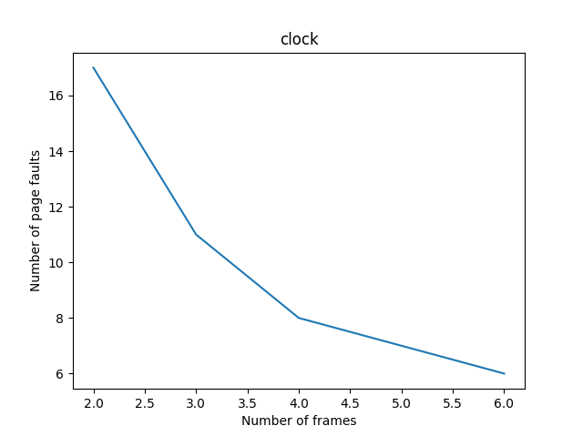
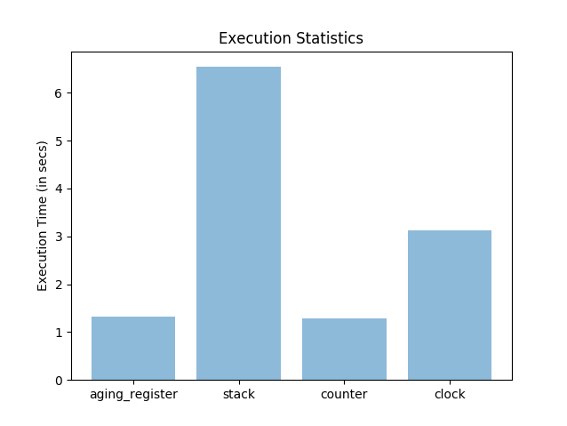

# Analysis of Different Page Replacement Algorithms

Enr no. | Name
-|-
16115028 | Arihant Jain
17114050 | Narendra Patel
17114064 | Rohit Ashiwal
16116043 | Parla Surendra Mani Kumar
16116064 | Shrey Aggarwal
16118078 | Shubhanshu Agarwal
16116069 | Suyash Mahar

## Introduction

In Operating Systems that use paging for memory management, page
replacement algorithm are needed to decide which page should be
replaced when new page comes in. Whenever, a new page is referred and
not present in memory, page fault occurs and Operating System replaces
one of the existing pages with different ways to decide which page to
replace. The target of all algorithms is to reduce the number of
page-faults.

## Least Recently Used Page Replacement

In Least Recently Used algorithm, we use the recent past as an
approximation of the near future, then we can replace the page that has
not been used for the longest period of time.
LRU replacement associates with each page the time of that's page last
use. When a page must be replaced, LRU chooses the page that has not
been used for the longest period of time. We can think of this strategy
as the optimal page-replacement algorithm looking backward in time,
rather than forward.

There are different methods to implement LRU:-

### Counter Method

In the simplest case, we associate with each page-table entry a
time-of-use field and add to the CPU a logical clock or counter. The
clock is incremented for every memory reference. Whenever a reference
to a page is made, the contents of the clock register are copied to the
time-of-use field in the page-table entry for that page. In this way,
we always have the "time" of the last reference to each page. We
replace the page with the smallest time value. This scheme requires a
search of the page-table to find the LRU page and a write to memory (to
the time-of-use field in the page-table) for each memory access. The
times must also be maintained when page tables are changed (due to CPU
scheduling). Overflow of the clock must be considered.

#### Page faults vs number of Frames

    

#### Complexity Analysis

For the `Find` operation, one needs to perform a lookup at particular
index in the Page Table. Thus the Time complexity of this opration is
O(1).

For the `Replace` operation, one needs to perform a linear search
through the page table to find the page with lowest value of `counter`
field. Thus the Time complexity of this operation is O(n) where n is
the total number of pages.

### Stack Method

Another approach to implementing LRU replacement is to keep a stack of
page numbers. Whenever a page is referenced, it is removed from the
stack and put on the top. In this way, the most recently used page is
always at the top of the stack, and the least recently used page
is always at the bottom. Because entries must be removed from the
middle of the stack, it is best to implement this approach by using a
doubly linked list with a head pointer and a tail pointer. Removing a
page and putting it on the top of the stack then requires changing six
pointers at worst. Each update is a little more expensive, but there is
no search for a replacement; the tail pointer points to the bottom of
the stack, which is the LRU page. This approach is particularly
appropriate for the software or microcode implementations of the LRU
replacement.

#### Page faults vs number of Frames

    

#### Complexity Analysis

For the `Find` operation, one needs to perform a linear search through
the stack or doubly-linked list to find a page with requested page
number. Thus the Time complexity of this operation is O(n) where n is
the number of pages in the stack.
> Note: We can use combination of `map` and `Set` to achieve complexity of O(log(n))

For the `Replace` operation, one needs to updates the tail pointer such
that it points to second page from the bottom of the stack. Thus the
Time complexity of this operation is O(1).

### Aging Register Method

We associate with each page-table entry a counter field and
additionally store a n-bit array of R bits. Here R stands for reference
and reference bit is set by the hardware whenever that page is
referenced(either by read or a write to any byte in the page). In
effect, the counters are an attempt to keep track of how often each
page has been referenced. The counters are each shifted right 1 bit and
then R bit is added to the leftmost bit of the counter. When a page
fault occurs, the page with the lowest counter is chosen for
replacement.

> Note: Aging Register method only behaves like LRU if there is only
one page is referenced in one clock cycle. Otherwise, this method would
be an approximation of LRU.

#### Page faults vs number of Frames

    

#### Complexity Analysis

For the `Find` operation, one needs to update the registers of every
page. In the worst case, one may need to scan through (n-1) nodes to
find the page. Thus the Time complexity of this operation is O(n) where
n is the total number of pages.

For the `Replace` operation, one needs to perform a linear search
through the page table to find the page with lowest value of
aging-register. Thus the Time complexity of this operation is O(n)
where n is the total number of pages.

## Aproximate LRU Page Replacement

### Clock Method

We associate with every page-table entry a R bit. When a page has been
selected, however, we inspect its reference bit. If the value is 0, we
proceed to replace this page; but if the reference bit is set to 1, we
give the page a second chance and move on to select the next FIFO page.
When a page gets a second chance, its reference bit is cleared, and its
arrival time is reset to the current time. Thus, if a page is used
often enough to keep its reference bit set, it will never be replaced

One way to implement this algorithm is as a circular queue. A pointer
indicates which page us to be replaced next. When a frame is needed,
the pointer advances until it finds a page with 0 reference bit. As it
advances, it clears the reference bits. Once a victim is found, the
page is replaced, and the new page is insertedin the circular queue in
that position.

#### Page faults vs number of Frames

    

#### Complexity Analysis

For the `Find` operation, one needs to perform a linear search through
the circular array to find the page with the requested page number. In
the worst case, one may need to scan through (n-1) nodes to find the
page. Thus the Time complexity of this operation is O(n) where n is the
total number of pages.

For the `Replace` operation, one needs to perform a linear search
through the circular queue to find a page with R bit 0. In the worst
case, one may need to scan through (n-1) nodes to find the page. Thus
the Time complexity of this operation is O(n) where n is the total
number of pages.

## Execution time Analysis

    

